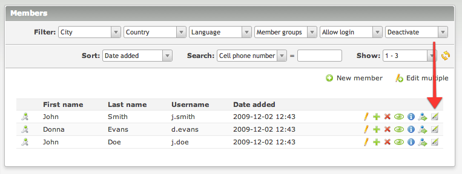

# Member Content – Documentation

## Adding content

The individual content for each member can be added in the `Members module`. Use the last icon in the row of each entry 
to access the content view. You can add as many as different content elements as you like, just like for articles, 
news or events.

Then create a new front end module of type `Member content` and place it on the protected page. 
It will display the content specific for the currently logged in user.

