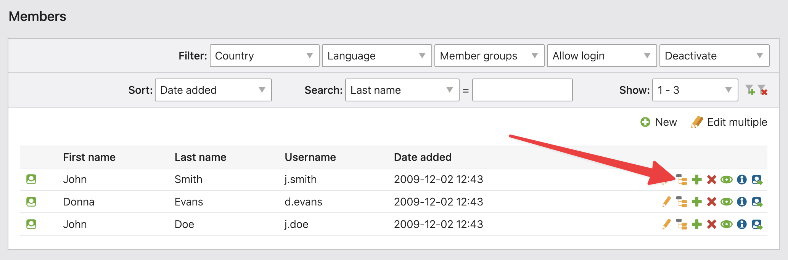

# Member Content – Documentation

## Adding Content

To add individual content for a member, open the "Members" module in the Contao back end. Click the edit children icon for the desired member to access their personal content view.

You can add any number of content elements here — just as you would for articles, news, or events.

Next, create a new front end module of type "Member content" and place it on a protected page. When a user logs in, the module will render the content assigned specifically to them.
